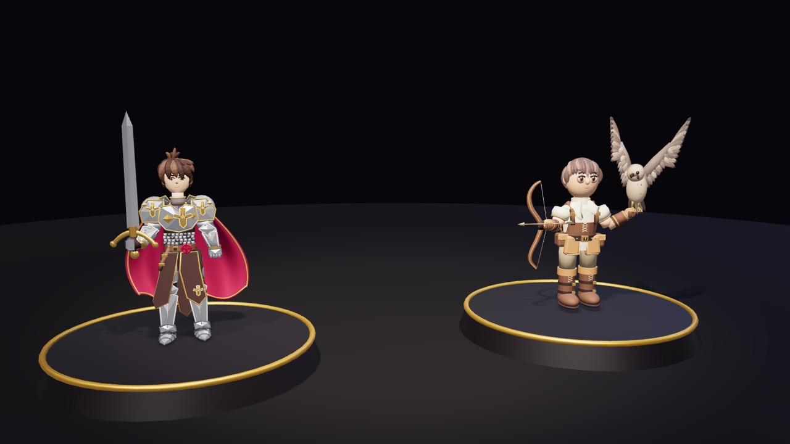
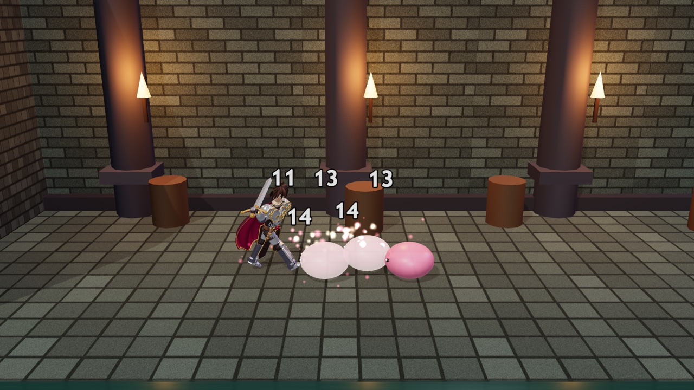
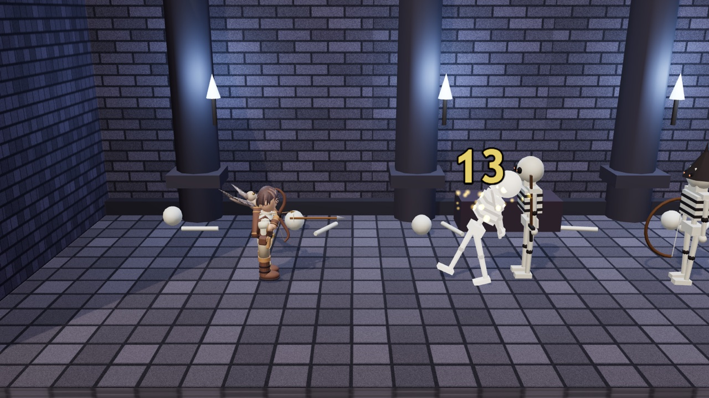
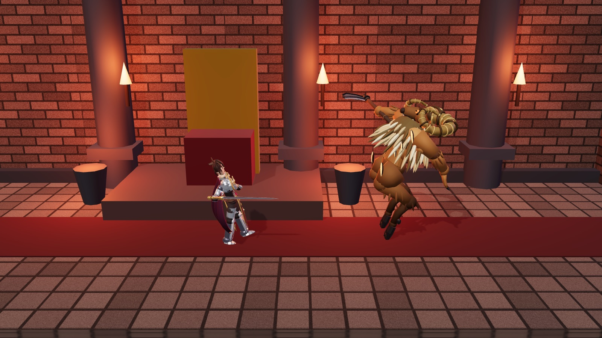

# Dungeon RO

3D belt-scrolling dungeon brawler in the Dungeon & Fighter mould, with the two Ragnarok heroes
modelled in `../ragnarok-defender/assets/blender/` (RO Knight, Hunter & Falcon). Three.js
(vendored, no build step), vanilla ES modules, fills whatever screen it gets. Sibling of
`../ragnarok-defender` and `../badminton` and follows the same conventions.



| Sewer Entrance — knight's sword chain | Bone Crypt — hunter vs. skeletons |
|---|---|
|  |  |



```bash
npm run dev      # http://localhost:8082  (no-store static server)
npm test         # node --test: pure sim tests + a Three-in-Node render smoke test (no WebGL)
npm run sim      # headless bot plays the whole dungeon with both heroes (balance harness)
npm run export   # re-bake assets/heroes/*.glb from the source .blend files (needs Blender)
```

Arrows / WASD move on the floor (x = along the room, up/down = depth lane), **J** attack,
**K** jump, **L** dash, **U I O** skills, **M** mute, **P** pause, **Enter** start. Gamepads
work (X attack, A jump, B dash, Y / RB / LB skills, Start pause).

Both phone orientations are supported. Portrait zooms the camera out so you can still see
ahead; landscape is the better fit for a belt-scroller and gets a compact HUD and smaller
thumb buttons below 500 px of height, keyed on height rather than on orientation so a short
desktop window behaves the same. `viewport-fit=cover` means the page runs under the notch and
the home indicator, so every screen-edge offset is measured from `env(safe-area-inset-*)`.
Rotating mid-run re-lays out the controls, except while a thumb is down, because mobile
browsers also fire `resize` when the URL bar collapses.

Those are only the defaults. **Settings & controls**, reachable from the title screen and the
pause overlay, rebinds every action to up to three keys plus one gamepad button, and persists to
`localStorage`. Binding a key that is already in use takes it from whatever held it, so one
button never drives two actions; an action left with nothing bound is called out in the footer.
Gamepad movement stays on the left stick and d-pad and is deliberately not rebindable.

On-screen controls appear automatically on touchscreens and can be forced on or off from the
same menu, which also sets the stick side, size, dead zone, opacity, haptics, and whether the
stick is floating (the ring springs to wherever the thumb lands) or parked. **Arrange buttons**
drops into a drag-to-place mode for every control including the stick; positions are stored as
a fraction of the viewport so a layout arranged in landscape stays proportionally right after
a rotation. The stick reads from
a half-screen zone rather than the ring itself, because a thumb rarely lands on a 150 px circle.

## The one idea

Enemies telegraph everything and hit-stun is the whole economy. A basic combo locks a monster
in place; a launched monster can be juggled; anything winding up can be interrupted — except the
boss, who has super armour (`mass >= 3` in `combat.applyHit`) and must be dodged on read.
Ranged fire is beaten by stepping to another depth lane, not by blocking. Rooms restore 30 % HP
and all MP on entry, so every room is its own puzzle: read the pack, pick the skill. Monsters
drop red (HP) and blue (MP) potions — the red-potion chance jumps when you are under 40 % HP,
the belt-scroller pity rule (`DROPS` in `config.js`).

- **Knight**: 3-hit sword chain (`slash1 → slash2 → slash3`), Bash (single heavy hit, huge
  knockback), Magnum Break (radial launch), Bowling Bash (charge through the pack).
- **Hunter**: 3-shot arrow chain (the third pierces), Double Strafe, Arrow Shower (area launch
  ahead), Blitz Beat (the falcon dives the nearest monster three times).

Every attack is data in [src/sim/data/heroes.js](src/sim/data/heroes.js): a locked `dur`,
timed `hits` (boxes relative to the hero: x forward, y height, z depth tolerance), `spawns`
for projectiles, an optional `move` window and `cancelAt` — from there a buffered press chains
`next`, and a skill cancels a basic. Monsters are the same shape in
[src/sim/data/monsters.js](src/sim/data/monsters.js) with an `ai` (hopper / walker / archer /
boss) and long wind-ups on purpose. The dungeon is five rooms of waves in
[src/sim/data/dungeon.js](src/sim/data/dungeon.js), one lesson each.

## Layout

```
src/
  config.js            every tunable (sim step, floor lanes, player feel, camera)
  settings.js          PURE: key/pad bindings + touch layout, localStorage I/O, conflict rules
  input.js             keyboard / gamepad / touch → {held, pressed} snapshots, one per sim tick
  sim/                 PURE: no DOM, no Three.js, no Math.random
    game.js            createGame / update: rooms, waves, spawns, projectiles, potions, combo, events
    player.js          hero state machine: idle/walk/air/dash/attack/hurt/dead, buffers, cancels
    enemies.js         monster AI: enter → chase → windup → attack → recover, hurt/down, dead
    combat.js          boxHits (belt-scroller depth fudge), rollDamage, applyHit (knockback/launch)
    rng.js             mulberry32 — a run is (hero, seed, inputs)
    data/              heroes, monsters, dungeon — the design lives here
  render/              Three.js; never mutates the sim
    scene.js           renderer, lights, PMREM env, camera follow + shake, procedural rooms/themes
    heroes.js          GLB loading, limb rig, keyframe clips, falcon flight, i-frame blink
    monsters.js        primitive-built chibis (Poring, Lunatic, Skel Soldier/Archer, Orc Lord)
    anim.js            tiny pose system shared by heroes and humanoid monsters
    fx.js              particles, damage numbers, slash arcs, rings, arrows, arrow rain, potions
    hud.js             DOM: bars, room/wave, score/combo, boss bar, skill slots, banners, overlays
    settings-ui.js     DOM: the rebinding table and the on-screen-control tuning panel
    touch-layout.js    drag-to-place for the on-screen controls; applies the saved layout
    textures.js        procedural canvas textures (flagstones, bricks, sprites)
  audio.js             WebAudio synth voices, driven by game.events
  main.js              boot, title-screen hero turntable, fixed-step loop with hit-stop, window.__dro
assets/heroes/         knight.glb, hunter.glb, meta.json (baked, see Art)
vendor/three/          three r180 core + GLTFLoader, RoomEnvironment, BufferGeometryUtils (MIT)
tools/export_heroes.py Blender headless: static .blend → limb-segmented GLB
tools/mixamo_to_clip.py Blender headless: Mixamo .fbx → keys in the rigid-limb clip format
tools/preview_clip.py  Blender headless: render a clip onto an exported rig, for eyeballing
tools/playtest.mjs     headless balance harness
tests/                 44 tests: combat / player / game (pure) + a Three-in-Node render smoke test
```

The sim never imports the renderer and never touches `Math.random`, so a run is fully
determined by hero + seed + the input stream, which is what makes the harness trustworthy.
The one channel out is `game.events` — plain records (`attack`, `hit`, `kill`, `windup`,
`roomClear`, …) that fx, audio and the main loop (hit-stop) drain each frame; the sim never
reads them and the array is capped.

## Art

The source models are static posed sculpts — ~300 primitives each, grouped by *category*
(Body / Armor / Hair / Cloth / Sword), no rig. Rather than retopologise and skin them,
[tools/export_heroes.py](tools/export_heroes.py) re-groups every mesh by **limb** (name
keywords + side of the body), bakes the bevel/solidify modifiers, joins each limb into one
mesh whose origin is its joint, parents them into a nine-node hierarchy and exports a GLB:

```
root ─ torso ─ head / armL ─ weapon / armR / cape        (knight)
     ├ legL ├ legR
     └ falcon ─ wingL / wingR                             (hunter)
```

### Borrowing motion from Mixamo

Mixamo rigs are ~65-bone skeletons for skinned meshes; ours are seven rigid limbs posed by
Euler angles. A bone-for-bone transfer is therefore impossible — there is no forearm, shin
or spine chain to receive it. [tools/mixamo_to_clip.py](tools/mixamo_to_clip.py) measures the
*result* of the Mixamo pose instead and restates it in our channels: arms and legs are
**aimed** (shoulder → hand, hip → foot), which folds the elbow and knee into the one segment
we have and so keeps the reach of the pose; torso and head are real single joints on both
rigs, so their rotation transfers as a **delta**. Body yaw is divided out, because in game
the facing comes from the sim. The sampled curve is then cut down to a handful of keys by
inserting whichever frame is currently worst-reconstructed, scored through the same
smoothstep `evalClip` uses.

```sh
tools/mixamo_to_clip.sh anim.fbx --name cast --range 11:44 --gain legs=0.6,tz=0.5
tools/mixamo_to_clip.sh walk.fbx --name walk --loop 1     # one cyclic clip, no wind-up split
tools/preview_clip.sh baphomet cast --json out.json --out strip.png --views sideflat
```

`--loop` emits a single cycle instead of a wind-up/strike pair and re-centres the vertical
bob on the cycle mean. Mixamo ends a loop on a duplicate of frame 1, so the first and last
keys match and `walkPose`'s phase can drive it straight through `evalClip`, one cycle per
2π — which is how a type opts out of the shared sine walk.

What does *not* survive: elbows, knees and spine bend, and anything that assumes human legs
— Mixamo's are plantigrade, Baphomet's are digitigrade goat legs that bend the other way.
Treat the output as a strong first draft to art-direct with `--gain`, not as a finished clip.
Baphomet's `walk`, `windup` / `attack` and `castWindup` / `cast` in
[monsters.js](src/render/monsters.js) came through this path; everything else there is
hand-authored. Watch the gains: Mixamo's melee swing twists the torso 54 degrees, which
turns a boss out of a fight plane whose hit boxes run along X.

The game then animates the limbs procedurally: [src/render/anim.js](src/render/anim.js) is a
flat-channel keyframe system (`aLx` = left arm swings forward, `tx` = torso leans forward,
`cx` = cape blown back, …) and [src/render/heroes.js](src/render/heroes.js) holds one clip per
attack plus walk / idle / hurt / dash / dead. The hunter's bow arm is turned 90° at rest so the
bow faces the camera and points forward; the weapon node counter-rotates to stay vertical.
The falcon rides the draw hand and is re-parented to the world for Blitz Beat.

Re-bake after editing the .blend files (the exporter reads the sibling project's copies):

```bash
npm run export
```

Monsters are primitives built in code, like the sibling project's chibis. Rooms are procedural
too: canvas-drawn flagstone and brick textures, pillars, flickering torches and per-theme props
(sewer / crypt / throne).

**Names are placeholders.** Poring, Lunatic, Skel Soldier, Orc Lord and the RO skill names are
Gravity's; swap them for original names before publishing — the models, stats and behaviour are
all original so that is a string edit in `src/sim/data/`.

## Balance

`npm run sim` runs a deliberately dumb bot (walk to the nearest monster's lane, mash, fire
skills when ready, sidestep wind-ups, lane-dodge arrows, back off from the boss) through the
whole dungeon, five seeds per hero, and fails if fewer than half the runs clear it or any run
clears it flawlessly. Current tuning: the knight clears ~4/5, the hunter ~1–2/5 (the bot has
no boss strategy; a kiting hunter that lane-dodges the charge beats the Orc Lord with half her
HP). The Orc Lord has super armour, so the "stun-lock everything" plan that clears rooms 1–4
does not work on him — that is the point of the fight.

## Debug

In the browser console: `__dro.game` is the live state, `__dro.tick(n)` steps the sim `n`
frames with the current keyboard state, `__dro.play(n)` steps sim and visuals together,
`__dro.input.held.right = true` fakes a key, `__dro.hero('hunter')` restarts with a hero,
`__dro.heroView.def.rest` is the live rest pose.

Screenshots are taken by the game itself: `await __dro.shot('name')` renders one 1600×900
frame off the live canvas and `PUT`s it to the dev server, which writes
`docs/screenshots/name.png` (dev-only route in `serve.mjs`). Stage the moment with `__dro.play`
first — the ones above are `heroes`, `sewer`, `crypt`, `boss`.
